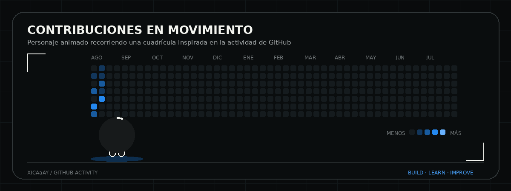

<div align="center">


<br />

[](https://xicay.dev)
[](https://github.com/xicaaay)
[](mailto:amilcar.xicay@indevelop.net)

</div>

---

## Perfil profesional

Soy desarrollador de software con dos años de experiencia en el diseño, planificación y desarrollo integral de sistemas. Me especializo en la construcción de lógica backend, diseño de APIs e integración con plataformas y servicios de terceros.

He participado en todo el ciclo de desarrollo: análisis de requerimientos, definición de arquitectura, diseño de interfaces, implementación, integración, despliegue y mantenimiento. Mi enfoque es construir soluciones completas, mantenibles y orientadas a resolver necesidades reales.

```txt
Frontend -> API -> Lógica de negocio -> Base de datos -> Integraciones -> Deploy
```

## Áreas de experiencia

| Área | Enfoque |
|---|---|
| Desarrollo full stack | Aplicaciones web completas, paneles administrativos, sitios públicos y módulos de gestión |
| Backend y APIs | APIs REST, autenticación JWT, roles, validaciones, servicios modulares e integraciones externas |
| Datos | Modelado relacional, migraciones, consultas, normalización y procesamiento de información |
| Automatización | Inteligencia artificial, Google Workspace, mensajería, reportes, webhooks y servicios de terceros |
| Infraestructura | Railway, Docker, variables de entorno, despliegues y mantenimiento de entornos |
| Experiencia de usuario | Interfaces responsivas, componentes reutilizables, estados, validaciones y mejora continua |

## Tecnologías y herramientas

<div align="center">


</div>

## Experiencia profesional

<table>
  <tr>
    <td width="28%"><strong>Feb. 2026 — Actualidad</strong></td>
    <td>
      <strong>Desarrollador Web Full Stack</strong><br />
      Code Crypto Marketing<br /><br />
      Desarrollo aplicaciones completas y plataformas internas, desde la interfaz hasta la lógica de negocio y la base de datos. Diseño APIs REST, integro servicios externos y automatizo flujos que conectan sistemas, datos y equipos de trabajo.
    </td>
  </tr>
  <tr>
    <td><strong>Nov. 2024 — Feb. 2026</strong></td>
    <td>
      <strong>Desarrollador Web Jr.</strong><br />
      Code Crypto Marketing<br /><br />
      Desarrollé y mantuve interfaces web responsivas, componentes reutilizables y flujos conectados con APIs. Participé en soluciones digitales para marcas nacionales e internacionales.
    </td>
  </tr>
  <tr>
    <td><strong>Sep. 2024 — Nov. 2024</strong></td>
    <td>
      <strong>Becario de Ingeniería de Software</strong><br />
      Code Crypto Marketing<br /><br />
      Apoyé la evaluación de herramientas tecnológicas, la creación de pruebas de concepto y la implementación de automatizaciones y flujos conversacionales.
    </td>
  </tr>
</table>

## Forma de trabajo

- Analizo el problema antes de definir la solución.
- Organizo el desarrollo por módulos y responsabilidades.
- Priorizo código mantenible, validado y fácil de escalar.
- Documento configuraciones, endpoints y procesos importantes.
- Trabajo de forma colaborativa y me adapto a nuevos requerimientos.
- Mantengo una mentalidad de aprendizaje y mejora continua.

## Actividad en GitHub

<div align="center">



<br />

[](https://github.com/xicaaay?tab=followers)
[](https://github.com/xicaaay)

</div>

> La animación es un recurso visual inspirado en el mapa de contribuciones. La actividad actual puede consultarse directamente en el perfil de GitHub.

## Formación

**Ingeniería en Sistemas de Información y Ciencias de la Computación**  
Universidad Mariano Gálvez · En curso

**Bachillerato en Ciencias y Letras con orientación en Computación**  
Instituto Tecnológico Dr. Theo Bloem · 2023 - 2024

## Contacto

- Portafolio: [xicay.dev](https://xicay.dev)
- GitHub: [github.com/xicaaay](https://github.com/xicaaay)
- Correo: [amilcar.xicay@indevelop.net](mailto:amilcar.xicay@indevelop.net)
- Ubicación: Guatemala, Guatemala

---

<div align="center">

<strong>Desarrollo soluciones completas: desde la idea y la arquitectura hasta el despliegue y mantenimiento.</strong>

</div>
