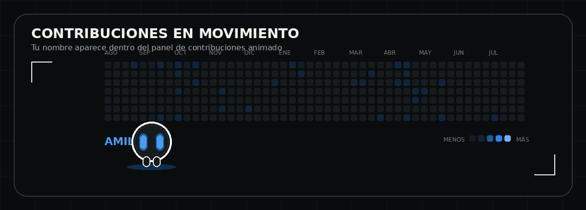

<div align="center">


<br />

[](https://xicay.dev)
[](https://github.com/xicaaay)
[](mailto:amilcar.xicay@indevelop.net)

<br />

[](https://git.io/typing-svg)

</div>

---

## `01. Sobre mí`

```ts
const profile = {
  name: "Amilcar Xicay",
  role: "Desarrollador Web Full Stack",
  experience: "2 años",
  portfolio: "https://xicay.dev"
}
```

Soy desarrollador de software con dos años de experiencia en el diseño, planificación y desarrollo integral de sistemas. Me especializo en la construcción de lógica backend, diseño de APIs e integración con plataformas y servicios de terceros.

He participado en todo el ciclo de desarrollo: análisis de requerimientos, arquitectura, diseño de interfaces, implementación, integración, despliegue y mantenimiento. Mi enfoque es construir soluciones completas, mantenibles y orientadas a resolver necesidades reales.

```bash
frontend -> api -> lógica de negocio -> base de datos -> integraciones -> deploy
```

## `02. Áreas de experiencia`

| Área | Enfoque |
|---|---|
| Desarrollo full stack | Aplicaciones web completas, paneles administrativos, sitios públicos y módulos de gestión |
| Backend y APIs | APIs REST, autenticación JWT, roles, validaciones, servicios modulares e integraciones externas |
| Datos | Modelado relacional, migraciones, consultas, normalización y procesamiento de información |
| Automatización | Inteligencia artificial, Google Workspace, mensajería, reportes, webhooks y servicios de terceros |
| Infraestructura | Railway, Docker, variables de entorno, despliegues y mantenimiento de entornos |
| Experiencia de usuario | Interfaces responsivas, componentes reutilizables, estados, validaciones y mejora continua |

## `03. Tecnologías y herramientas`

<div align="center">


</div>

## `04. Experiencia profesional`

```yaml
actual:
  puesto: Desarrollador Web Full Stack
  empresa: Code Crypto Marketing
  periodo: Feb. 2026 - Actualidad

anteriores:
  - puesto: Desarrollador Web Jr.
    empresa: Code Crypto Marketing
    periodo: Nov. 2024 - Feb. 2026

  - puesto: Becario de Ingeniería de Software
    empresa: Code Crypto Marketing
    periodo: Sep. 2024 - Nov. 2024
```

```txt
> Desarrollo aplicaciones completas y plataformas internas.
> Diseño APIs REST e integro servicios externos.
> Automatizo flujos que conectan sistemas, datos y equipos.
> Construyo interfaces responsivas y componentes reutilizables.
```

## `05. Skills`

| Habilidad | Aplicación profesional |
|---|---|
| Resolución de problemas | Competente para analizar situaciones, identificar causas y proponer soluciones prácticas |
| Pensamiento lógico y analítico | Capacidad para estructurar procesos, comprender dependencias y tomar decisiones técnicas |
| Aprendizaje continuo | Facilidad para aprender nuevas tecnologías, herramientas y metodologías de trabajo |
| Adaptabilidad | Capacidad para responder a cambios de requerimientos, prioridades y contextos de desarrollo |
| Responsabilidad y autonomía | Organización para gestionar tareas, cumplir objetivos y avanzar con independencia |
| Proactividad | Iniciativa para detectar mejoras, anticipar necesidades y proponer nuevas soluciones |
| Trabajo colaborativo | Comunicación clara y disposición para coordinar con equipos técnicos y no técnicos |
| Organización y documentación | Capacidad para estructurar módulos, registrar procesos y documentar configuraciones importantes |

## `06. Actividad en GitHub`

<div align="center">



</div>

### Estadísticas

<div align="center">


<br />


<br />

[](https://github.com/xicaaay?tab=followers)
[](https://github.com/xicaaay)
[](https://xicay.dev)

</div>

## `07. Formación`

### Ingeniería en Sistemas de Información y Ciencias de la Computación

**Universidad Mariano Gálvez**  
En curso

### Bachillerato en Ciencias y Letras con orientación en Computación

**Instituto Tecnológico Dr. Theo Bloem**  
2023 - 2024

## `08. Contacto`

| Canal | Información |
|---|---|
| Portafolio | [xicay.dev](https://xicay.dev) |
| GitHub | [github.com/xicaaay](https://github.com/xicaaay) |
| Correo | [amilcar.xicay@indevelop.net](mailto:amilcar.xicay@indevelop.net) |
| Ubicación | Guatemala, Guatemala |

---

<div align="center">
  <strong>Desarrollo soluciones completas: desde la idea y la arquitectura hasta el despliegue y mantenimiento.</strong>
</div>
